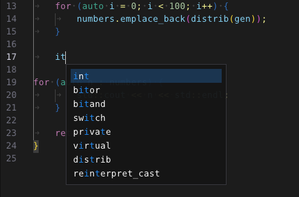

# Autocomplete

The text editor provides an optional autocomplete framework. Once configured, the editor
takes care of activation events (triggering), state tracking, visualization and insertion
of suggestions with full undo/redo. The application is responsible for providing the list
of suggestions through a callback or the API. This allows simple implementations to provide
suggestions in realtime and allows other implementations to do things asynchronously like
reaching out to a language server. Autocomplete can't be triggered when multiple cursors
are active as this causes a mess. Try it in Visual Studio Code if you want to see what I mean.



To activate the feature, the app must provide a configuration like:

```c++
TextEditor::AutoCompleteConfig config;

config.callback = [this](TextEditor::AutoCompleteState& state) {
	....
};

editor.SetAutoCompleteConfig(&config);
```

Deactivation can be achieved by passing **nullptr** to **SetAutoCompleteConfig**.
The **TextEditor::AutoCompleteConfig** class contains all the configuration options
and is defined as (please note defaults):

```c++
class AutoCompleteConfig {
public:
	// specifies whether typing by the user triggers autocomplete
	bool triggersOnTyping = true;

	// specifies whether the specified shortcut triggers autocomplete
	bool triggersOnShortcut = true;

	// specifies whether typing (or shortcut) in comments or strings triggers autocomplete
	bool triggerInComments = false;
	bool triggerInStrings = false;

	// manual trigger key sequence (default is Ctrl+space on all platforms, even MacOS)
	// remember Dear ImGui reverses Ctrl and Command on MacOS
#if __APPLE__
	ImGuiKeyChord triggerShortcut = ImGuiMod_Super | ImGuiKey_Space;
#else
	ImGuiKeyChord triggerShortcut = ImGuiMod_Ctrl || ImGuiKey_Space;
#endif

	// see if single suggestions are automatically inserted
	bool autoInsertSingleSuggestions = false;

	// delay in milliseconds between autocomplete trigger and suggestions popup
	std::chrono::milliseconds triggerDelay{200};

	// called when autocomplete is configured, active and the editor needs an updated suggestions list
	// callback must populate and order suggestions in state object
	// suggestion list is not cleared by editor between callbacks
	// callback is called during the rendering process (so don't take too long)

	// if it does takes too long, application should do search in separate thread and
	// use API to report results (see SetAutoCompleteSuggestions)
	std::function<void(AutoCompleteState&)> callback;

	// optional opaque void* that must be managed externally but passed to callback
	void* userData = nullptr;
};
```

When the callback is activated, a **TextEditor::AutoCompleteState** object is passed
informing the app about the context and providing space to return suggestions.
It is defined as:

```c++
class AutoCompleteState {
public:
	// current context (strings = UTF-8, columns = Nth visible column and indices = Nth codepoint)
	// to understand the difference between column and index, think like a tab :-)
	std::string searchTerm;
	size_t line;
	size_t searchTermStartColumn;
	size_t searchTermStartIndex;
	size_t searchTermEndColumn;
	size_t searchTermEndIndex;

	bool inIdentifier;
	bool inNumber;
	bool inComment;
	bool inString;

	// currently selected language (could be nullptr if no language is selected)
	const Language* language;

	// opaque void* provided by app when autocomplete was setup
	void* userData;

	// auto complete suggestions te be provided by app callback
	// only the first 10 are rendered in the order provided (so app is responsible for sorting)

	// the editor does not automatically include language specific keywords or identifiers in the suggestion list
	// this is left to the application so it can be context specific in case a language server is used
	// a pointer to the current language definition is provided so callbacks have easy access
};
```

The editor also comes with a Trie class that implements fuzzy searching and
the example app shows how it can be used. Given that this is a primitive,
poor-man's solution, more sophisticated solutions probably required external
language engines/services that are beyond the scope of this editor. With the
provided API however, connections to external capabilities can be established
and context-sensitive suggestions can be provided based on the most advanced
algorithms (even good-old AI slop :-)
